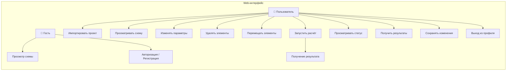
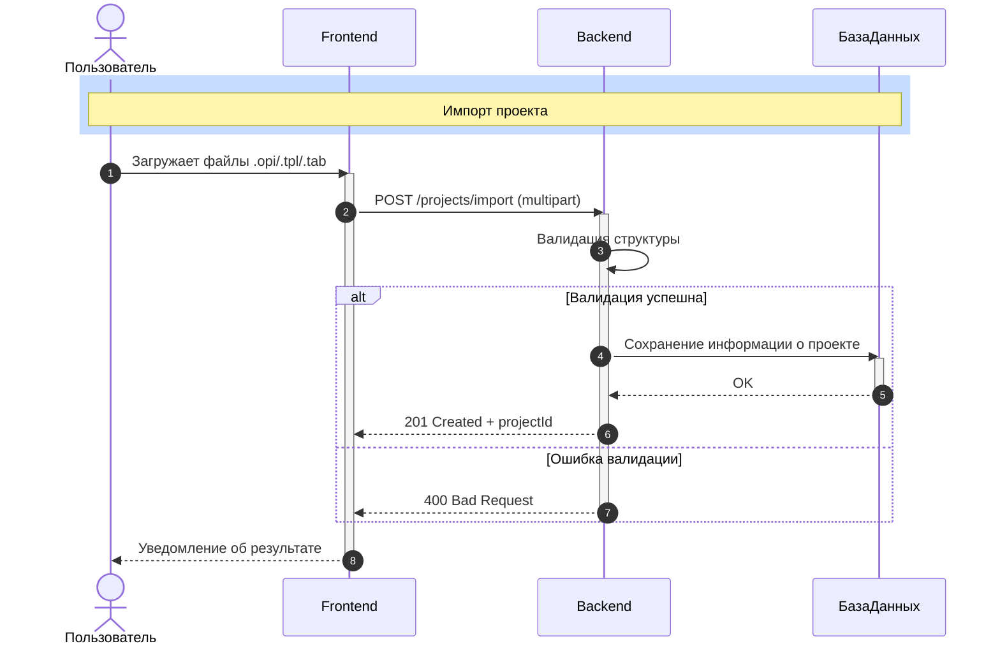
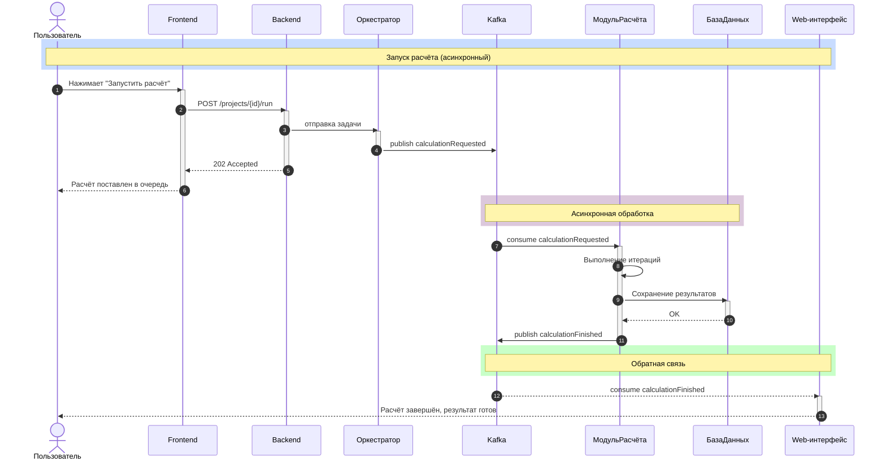

# ТЗ для FrontEnd

**Обновлено:** 29 мая 2025, 18:30

## Содержание

1. [Термины и определения](#термины-и-определения)
2. [Диаграммы](#диаграммы)
3. [Дизайн](#дизайн)
4. [Use Case (поведение)](#use-case-поведение)
5. [UC (Use Case как описание экранной формы)](#uc-use-case-как-описание-экранной-формы)

## Термины и определения

| Термин | Описание |
|--------|----------|
| OLGA-проект | Модель трубопроводной системы, задаваемая файлами `.opi/.tpl/.tab` |
| Канвас | Область визуализации схемы трубопровода |
| Элемент схемы | Труба, источник, узел или сегмент |
| Параметры | Технические свойства элемента (давление, длина, диаметр и пр.) |
| Сценарий | Конкретное пользовательское действие или путь взаимодействия |

## Диаграммы

Основная диаграмма взаимодействия компонентов:

- Web-интерфейс
- Просмотр схемы
- Авторизация / Регистрация
- Импортировать проект
- Просматривать схему
- Изменять параметры
- Удалять элементы
- Перемещать элементы
- Запустить расчёт
- Получение результата
- Просматривать статус
- Получить результаты
- Сохранять изменения
- Выход из профиля

Юзеры: Гость, Пользователь

## Дизайн

### Стиль

- Минималистичный интерфейс
- Белый фон, нейтральная цветовая гамма
- Схема трубопровода выполнена в серо-голубых тонах
- Плавные анимации появления/исчезновения панелей и выделения объектов
- Иконки и элементы управления — с плоским (flat) дизайном без теней

### Рабочая область (канвас)

- Основное поле проектирования схемы
- Поддержка масштабирования (Zoom in / Zoom out)
- Отображение координатной сетки (опционально)
- Выделение объектов с визуальной подсветкой

### Панель параметров

- Открывается при клике на объект на схеме
- Содержит редактируемые поля: давление, диаметр, длина, метки и др.
- Поддерживает валидацию введённых значений
- Может скрываться автоматически (по ESC или повторному клику вне объекта)

### Меню и панели

- Верхняя панель — вкладки: Схема, Параметры, Задачи, Результаты
- Левая панель — список элементов сети (иконками): трубы, источники, клапаны и др.
- Нижняя панель — строка состояния (валидация, координаты курсора)

## Use Case (поведение)

### Импорт OLGA-проекта

| Поле | Описание |
|------|----------|
| Название | Импорт проекта |
| Дизайн | Кнопка "Импортировать", диалоговое окно загрузки файлов |
| Описание | Пользователь загружает `.opi` (автоматически подтягиваются `.tpl`, `.tab`). Проект отображается на схеме |
| Участники | Пользователь, Frontend, Backend |
| Предусловия | Пользователь на главной странице интерфейса, проект не загружен |
| Постусловия | Проект визуализирован на канвасе |
| Триггер | Нажатие на кнопку "Импортировать" |
| Ограничения | Только `.opi`, размер до 50 МБ |

#### Основной сценарий:

1. Пользователь нажимает кнопку **«Импортировать проект»**
2. Открывается диалог выбора файлов
3. Пользователь выбирает файл .opi
4. Frontend формирует multipart/form-data запрос
5. Frontend отправляет POST /projects/import на backend
6. Backend принимает файлы, валидирует структуру
7. Backend сохраняет данные проекта в базу данных
8. Backend возвращает 201 Created и projectId
9. Frontend отображает сообщение об успешном импорте
10. Схема проекта визуализируется на канвасе

#### Альтернативные сценарии:

**Ошибка формата или повреждённый файл:**
- Backend возвращает `400 Bad Request`
- Frontend отображает уведомление: «Ошибка формата или повреждённый файл»

**Отсутствует файл `.tpl`:**
- Пользователь загружает только `.opi`
- Backend анализирует `.opi` и пытается найти `.tpl` в соседнем каталоге
- Если `.tpl` найден — импорт продолжается
- Если не найден — frontend отображает сообщение «Файл .tpl не найден» и предлагает загрузить вручную

### Диаграмма

### Запуск расчета

| Поле | Описание |
|------|----------|
| Название | Запуск расчёта |
| Дизайн | Кнопка "Запустить расчёт", индикатор статуса |
| Описание | Пользователь инициирует расчёт, получает результат |
| Участники | Пользователь, Frontend, Backend, Расчётное ядро |
| Предусловия | Загружен проект, параметры не пусты |
| Постусловия | Отображён результат расчёта |
| Триггер | Нажатие "Запустить расчёт" |
| Ограничения | Только если проект корректен |

#### Основной сценарий:

1. Пользователь нажимает кнопку «Расчёт»
2. Отправка POST-запроса `/projects/{id}/run`
3. Сервер инициализирует расчёт, возвращает `202 Accepted`
4. UI отображает индикатор расчёта (лоадер)
5. По WebSocket / Polling приходит событие `calculationFinished`
6. UI делает GET-запрос `/projects/{id}/results`
7. Пользователь смотрит результат

#### Альтернативные действия:

- Лоадер остаётся активным, отображается сообщение: «Расчет идет»
- WebSocket возвращает `calculationFailed`, UI показывает сообщение об ошибке
- При следующем входе UI проверяет статус расчёта и предлагает повторный запуск
- UI показывает таблицу или график с результатами

### Диаграмма

## UC (Use Case как описание экранной формы)

### Главный экран проекта

| № | Элемент | Описание/Условие | Источник данных | Возможные сценарии |
|----|---------|------------------|-----------------|-------------------|
| 1 | Кнопка «Импорт» | Открывает диалог выбора файлов `.opi`, `.tpl`, `.tab` | UI | `Активна` / `Заблокирована (в процессе загрузки)` |
| 2 | Канвас | Визуализирует структуру трубопроводной схемы | Backend (структура) | `Пустой` / `Отрисован` / `Ошибка загрузки` |
| 3 | Панель параметров | Показывает и редактирует свойства выбранного объекта | Backend (по ID) | `Скрыта` / `Открыта` / `Редактируется` |
| 4 | Кнопка «Расчёт» | Запускает расчёт проекта (POST `/projects/{id}/run`) | UI → API | `Активна` / `Отключена (нет данных)` / `В процессе` |
| 5 | Индикатор расчёта | Показывает статус выполнения расчёта, прогресс | Socket | `Скрыт` / `Активен (анимация)` / `Успех` / `Ошибка` |
| 6 | Результаты | Отображает таблицу и графики с результатами расчёта | API: /results | `Скрыт` / `Отображён` / `Пусто` / `Ошибка` |

---

**Источник:** Яндекс Вики - ТЗ для FrontEnd
**Дата:** 29 мая 2025
